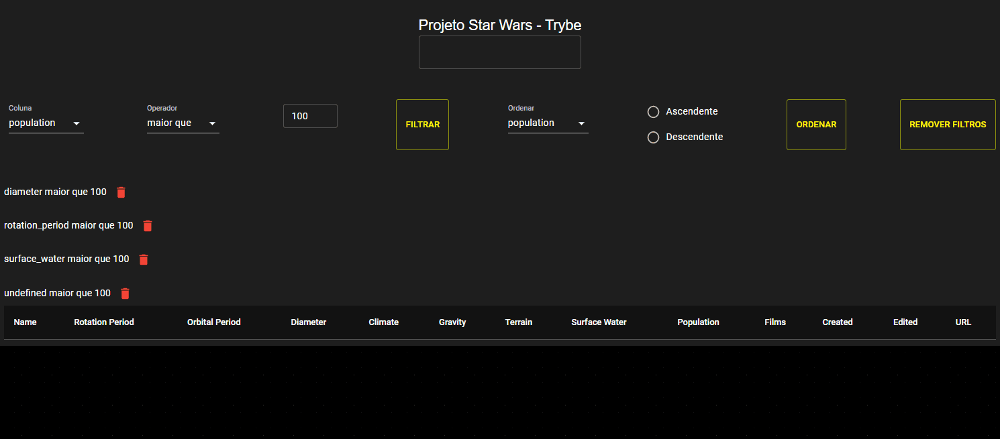

# Star Wars Planets Search

## Descrição

Projeto criado utilizando Context API e Hooks.

---

## Funcionalidades

- **Busca por Nome**: Permite buscar planetas pelo nome.
- **Filtros**: Filtra planetas por diversas características.
- **Ordenação**: Ordena planetas de forma ascendente ou descendente.

---

## Tecnologias Utilizadas

- JavaScript
- React
- Context API
- Hooks
- CSS

---

## Instalação e Execução

Siga os passos abaixo para clonar e executar o projeto localmente:

1. Clone o repositório:
   ```bash
   git clone git@github.com:seu-usuario/seu-repositorio.git
   ```
2. Navegue até o diretório do projeto:
   ```bash
   cd seu-repositorio
   ```
3. Instale as dependências:
   ```bash
   npm install
   ```
4. Inicie a aplicação:
   ```bash
   npm start
   ```
   A aplicação será aberta no seu navegador.

---

## Qualidade de Código

Para garantir a qualidade do código, este projeto utiliza `ESLint` e `Stylelint`. Para rodar o linter, use os comandos abaixo:

```bash
npm run lint
npm run lint:styles
```

---

## Demonstração de Uso

### Buscando pelo Nome do Planeta


### Filtrando pelo Valor da Coluna


### Usando Filtros em Conjunto


### Testando Quantidade de Filtros Disponíveis


### Removendo Filtros Ativos


### Ordenando Colunas


---
